# Atlanta Crime Mapping for CS7641 - Group 17
#### Abdurrahmane Rikli, Gabriel Leventhal-Douglas, Kevin Tynes, Aayush Dubey, and Sanjeev Prasada


# Introduction
## Motivation
In Atlanta, the overall crime rate is 108% higher than the national average. Crime is an ever-present concern. With almost 30 thousand crimes a year and a 61% crime rate per capita, Atlanta is one of the 3% most dangerous cities in the United States [1]. With such issues, the police force cannot deal with crime on a case-by-case basis. They need to be directed to crime-heavy areas preemptively.

#### What are you trying to do to tackle with your project motivation or problem?
Sufficient patrols in crime-heavy areas can be achieved using a prediction model to estimate the areas with the most severe crimes. More dangerous crimes can be preempted. With a real-time updating machine learning model, the police force can consistently catch up with crimes before they even occur day by day, and more often than not, their presence alone is enough to prevent crimes from occurring. Overall, as long as informative data is fed into the model, average crime rate is sure to consistently drop.

We reviewed literature of machine learning crime prediction methods using spatial [5, 3] and temporal [2] data in conjunction with crime-type. We will build upon this prior work by applying these methods to Atlanta crime data and improving predictive model efficiency.

#### What have people already done?
Crime statistics -likelihood for the most part- were predicted per 100k people in the state of Mississipi, irrespective of any features aside from the state's crime type statistics in their paper[2]. For the most part, time and space relevant features were examined only within the context of splitting areas into grids, and predicting intensity and displacement[3], although there were some attempts at clustering crime occurrences [5]. Closest to our approach was an attempt at predicting crime occurrences through similar features using KNN and Boosted Decision Tree, although the accuracy was 44% at its highest[4].

## Dataset
Our dataset comes from the Atlanta PD Crime Statistics dataset publicly available on the [Atlanta PD website](https://www.atlantapd.org/i-want-to/crime-data-downloads). This data is available as two separate datasets 'COBRA-2009-2018' and 'COBRA-2019'. After analyzing the Atlanta PD Crime dataset from 2009-2018, the most popular crimes in descending order are larceny from vehicle, larceny non vehicle, burglary at residence, and automobile theft.

Our dataset is record-based; each row in the dataset represents one crime and the features of that crime (represented below in tables). We have a total of 20 features per record and a total of 317,905 records of crime within the Perimeter of Atlanta. There were a few columns we had to remove due a large number of null's and a few rows were removed based on inconsistency of data.

Using our initial record-based dataset, we created count-based datasets to enable us to predict number of crimes that will occur on each day and in each neighborhood. For these datasets, our target features for our supervised models were counts in each crime severity category, and an associated crime score based on these counts.


### Original Dataset

Report Number | Report Date | Occur Date | Occur Time | Possible Date | Possible Time | Beat | Apartment Office Prefix | Apartment Number | Location | Shift Occurence | Location Type | UCR Literal | UCR # | IBR Code | Neighborhood | NPU | Latitude | Longitude
------------- |:-----------:|:----------:|:----------:|:-------------:|:-------------:|:----:|:-----------------------:|:----------------:|:--------:|:---------------:|:-------------:|:-----------:|:-----:|:--------:|:------------:|:---:|:--------:|:--------:
090010930 | 2009-01-01 | 2009-01-01 | 1145 | 2009-01-01 | 1148 | 408 |  |  | 2841 GREENBRIAR PKWY | Day Watch | 8 | LARCENY-NON VEHICLE | 0630 | 2303 | Greenbriar | R | 33.688450000000003 | -84.493279999999999
090011083 | 2009-01-01 | 2009-01-01 | 1330 | 2009-01-01 | 1330 | 506 |  |  | 12 BROAD ST SW | Day Watch | 9 | LARCENY-NON VEHICLE | 0630 | 2303 | Downtown | M | 33.7532 | -84.392009999999999
090011208 | 2009-01-01 | 2009-01-01 | 1500 | 2009-01-01 | 1520 | 413 |  |  | 3500 MARTIN L KING JR DR SW | Unknown | 8 | LARCENY-NON VEHICLE | 0630 | 2303 | Adamsville | H | 33.757350000000002 | -84.50282  
 ... | ... | ... | ... | ... | ... | ... | ... | ... | ... | ... | ... | ... | ... | ... | ... | ... | ... | ...

### Unsupervised algorithms preprocessed dataset

Occur Date  | Occur Time  | Day of Week  |	Month 	| Day of Month |	Year  | Latitude   | Longitude  |  Crime Category
 -----------|:-----------:|:------------:|:--------:|:------------:|:--------:|:----------:|:----------:|:---------------:
 2009-01-01 | 0745		  | 	1	     |	  3		|		23	   |	18    |   33.69    |  -84.49    |  	4
 2009-01-01 | 1030		  |	    6	     |    7		|		4	   |    9	  |   33.82	   |  -84.39    |  	4
 2009-01-01 | 1615		  |		0	     |    9		|		16	   |	13    |   33.76	   |  -84.50    |  	3
 ...        | ...         |    ...       |   ...    |    ...       |   ...	  |		...    |  ...  		| 	...

### Supervised algorithms dataset

Year  | Month |  Day  | Day of Week  | Category 1 | Category 2 | Category 3 | Category 4 
 -----|:-----:|:-----:|:------------:|:----------:|:----------:|:----------:|:----------:
 2009 | 1     |   1   | 3            | 0          |  15        |    58      |  48
 2009 | 1     |   2   | 4            | 0          |  15        |    46      |  73
 2009 | 1     |   3   | 5            | 1          |  21        |    37      |  56
 ...  | ...   | ...   | ...          | ...        |  ...       |    ...     |  ...       

## Approach

For our unsupervised learning, we clustered based on both location and time to provide us more insights about the dataset that will be useful in understanding the data prior to building our predictive models with supervised learning algorithms. We also employed dimensionality reduction algorithms to explore the relationship between variables in our dataset's feature space. 

For our supervised learning, we explored various algorithms to help predict crime severity across neighborhoods and time. In our record-based datasets, we employed classification methods to predict crime category of different crime occurrences. In our count-based datasets, we employed regression methods to predict the calculated crime score of different neighborhoods on different days. 

Throughout our modeling and data pre-processing, we used primarily Python, along with a few Python packages: sci-kit learn, sci-py, pandas, and numpy.

#### What is new in our approach?
We generated a crime score for each neighborhood and for each day. This is our "secret sauce". We believe that in order to label locations as __hotspots__, we needed to aggregate a score which accounts for severity of different crimes. This feature was created to encapsulate the level of crime in a neighborhood and/or on a given day in a single value. We felt that using this crime score as our predictor feature brought us closer to our use case of helping civilians and the police force be able to determine crime across time and neighborhoods.

We grouped types of crime into four categories based on our research and opinions on the severity of crimes. We then associated a weight to each category, and increased weight by order of 10 for more severe crimes.

 Category |     Crimes in Category     |   Weight
 :--------|:--------------------------:|-------------:
 1        | homicides, manslaughter    | 1000x
 2        | aggravated assault, robbery| 100x
 3        | burgulary, auto-theft      | 10x
 4        | larceny                    | 1x

Crime score is calculated as a weighted sum of crime category counts in a particular location and time. For example, in 2019, the worst crime score was in 'Downtown' with a neighborhood score of 23254.

 __Crime Score Calculation:__

 


<p float="left">
  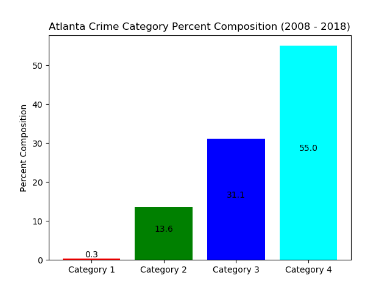
  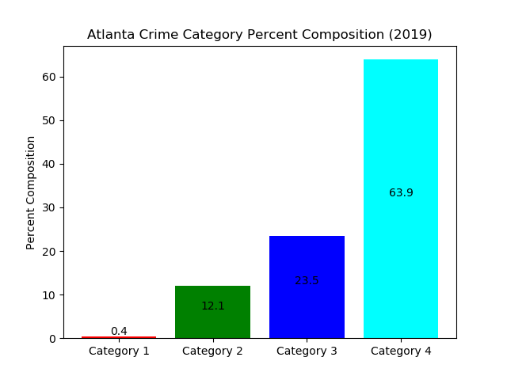
</p>

<p align="center">
  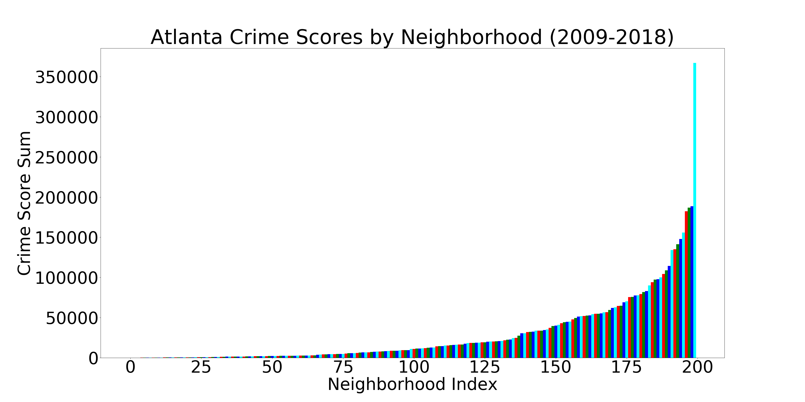
  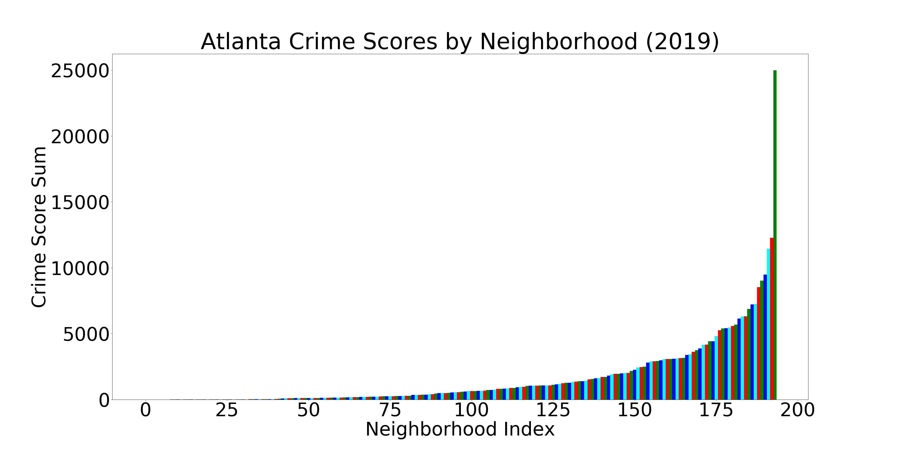
</p>

 __Top 5 Crime Scores:__

 Rank     |     Neighborhood     |2008-2019 Sum | 2019 Sum (YTD)
 :--------|:--------------------:|-------------:|-------------:
 1        | Downtown             | 366925        | 24984
 2        | Midtown              | 188754        | 12283   
 3        | West End             | 186872        | 9031
 4        | Old Fourth Ward      | 182502        | 11441
 5        | Grove Park           | 155795        | 9488


 __Bottom 5 Crime Scores:__

 Rank     |     Neighborhood     |2008-2019 Sum | 2019 Sum (YTD)
 :--------|:--------------------:|-------------:|-------------:
 200      | Edmund Park          | 24           | 10
 199      | Mays                 | 25           | 10      
 198      | Carroll Heights      | 31           | 0
 197      | Englewood Manor      | 110          | 0
 196      | Horseshoe Community  | 129          | 10


## Visualization
### Crime intensities across the city limits of Atlanta.

These figures of Atlanta are from the 2009-2018 dataset, visualizing the total count of crimes that occurred.


These figures of Atlanta visualize the total count of crimes that occurred for each crime-category.


### How we created the visualizations:
Shapefiles were sourced from the Atlanta Regional Commission (ARC). They include the information for the shapes and coordinates for the different neighborhoods of Atlanta. The data for crime scores, categories, and neighborhoods was generated using the publicly available crime reports from the Atlanta Police Department website, and imported as a CSV.

Each neighborhood in Atlanta was colored based on the intensity of the crime count/score, using the seaborn package. For data that was missing from either the ARC Shapefiles or the crime reports, the neighborhoods were intentionally left white. For example, "Airport" is technically a neighborhood on its own in Atlanta, but there were no reported crimes for it in the dataset. In all other cases, the darker colors indicate a higher intensity in crime count/score.

#### 2019 Actual Data (Ground Truth)
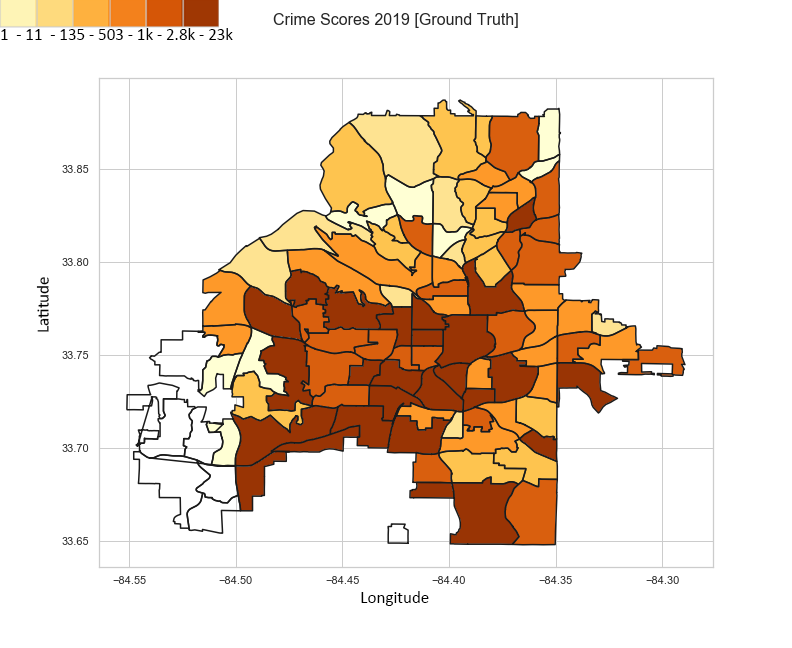
This image is a visualization of our ground truth data from the 2019 dataset.

#### 2019 Predicted Data using ML (Naive Bayes)
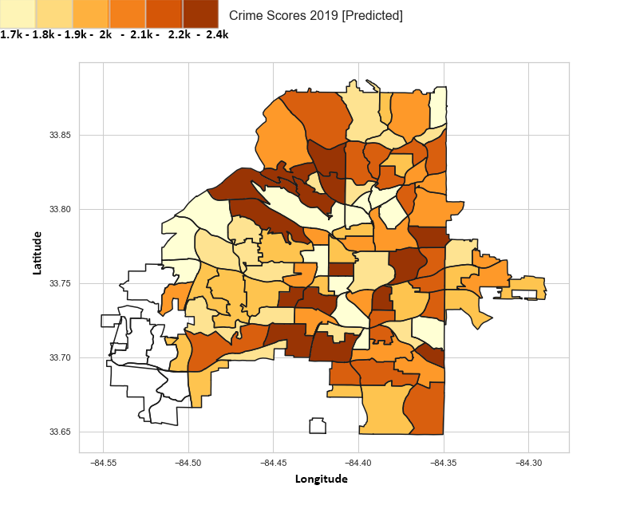

This image is our machine learning model's predicted 2019 data. We found Naive Bayes to have the higher accuracy among our attempted methods.

## Unsupervised Methods
Initially we wanted to explore our data more to understand if certain associations of crime category could be inferred from selected features. For unsupervised methods we conducted Dimensionality Reduction (PCA/LDA) and Clustering (KMeans, Mean Shift, and DBSCAN). Data was preprocessed with helper functions to parse features from `['Occur Date']`

### Dimensionality Reduction
Within dimensionality reduction we were interested in if certain components/discriminants would contain high explained variance ratios. This would indicate to us which components (or features) may be of relative importance. LDA results were found to be less conclusive than PCA, and were hence not included. We decided to select the most relevant numerical features for our algorithms to include in PCA.     

Features selected for PCA:  
`['Occur Date','Occur Time','Day of Week','Month','Day of Month','Year','Latitude','Longitude','Crime Category']` on  
+ Cleaned crime data for COBRA-2009-2018  
+ Cleaned crime data for COBRA-2019  
Numerical features were scaled to unit variance of centered data before performing PCA.  
You will notice cobra-clean2019.csv has less components due to `['Year']` being removed from features (as all data is from 2019).  

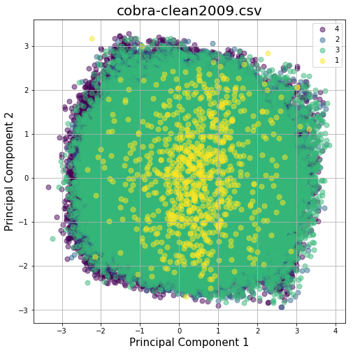 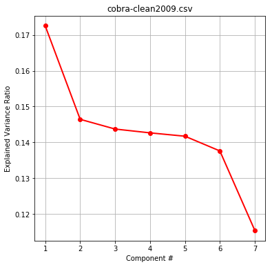        
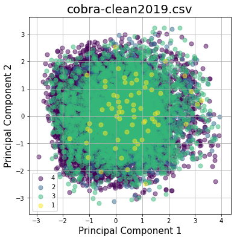 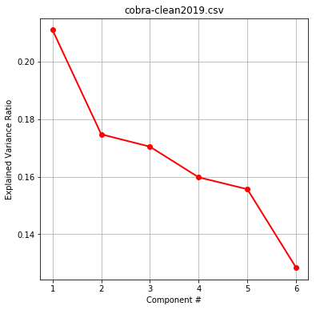     

Scatter plots of the first two components show little separation between groups.    
Exploring explained variance ratios per component reveal a similar relative margin between components. Therefore we need to maximize our feature inclusion, and are justified in regularizing our data.     

### Location-based Clustering    

Our intial thoughts were to cluster by longitude and latitude to see if there was any uneven location distribution.  
We utilized Elbow Method plots to determine optimal epsilon given min_samples for DBSCAN, and optimal K-value for KMeans.  

Clusters were plotted separately and overlayed with crime categories to determine any location trends, yielding disparate results. DBSCAN followed a similar trend and did not yield much visual insight.  

KMeans Location Results  
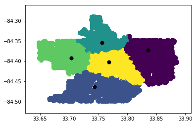 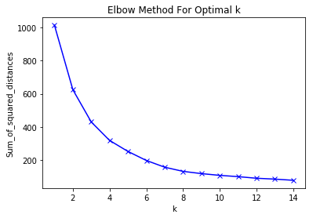


Mean Shift Location Results  
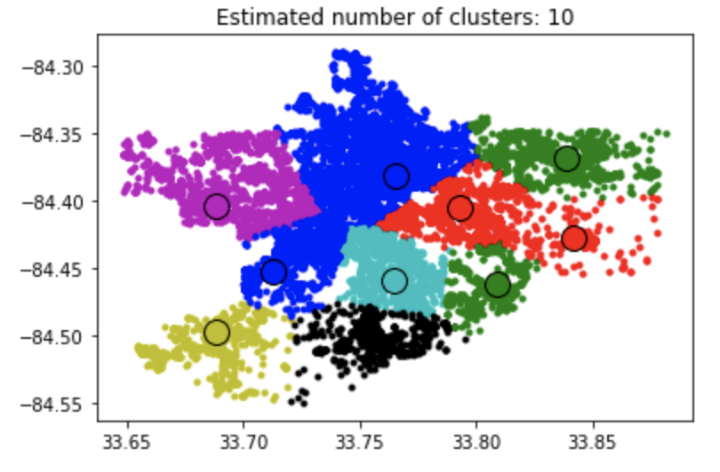


### Multi-Feature KMeans Clustering With & Without PCA

As location-based clustering, and PCA on it's own yielded little utility in our overall project goal, we then proceeded with multi-feature exploratory KMeans clustering.  
Features included were consistent from the previous PCA method:  
`['Occur Date','Occur Time','Day of Week','Month','Day of Month','Year','Latitude','Longitude','Crime Category']`  
Initially KMeans was conducted on all normalized features, and all combinations of features were plotted and colored by associated cluster. Then in an attempt to further explore our data, we performed PCA prior to clustering. Each cluster was plotted and overlayed with colors corresponding to crime category (indexed from previous operations). However, as our results below indicate, this approach also yielded little insight.  

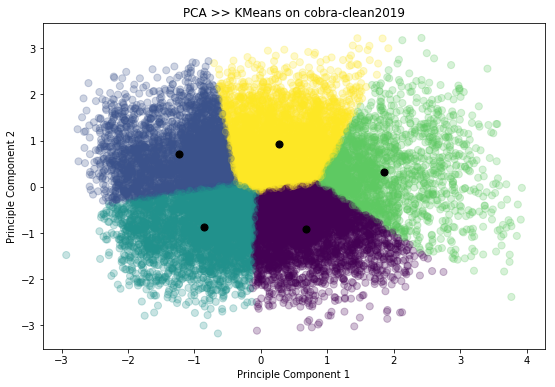  


### Feature Generation for Supervised Methods

To include more features within our unsupervised approach we decided to generate new features with KMeans for our supervised methods. This would hopefully increase the amount of information, and accuracy potentially achieved downstream.    

First we normalized our data to a standard scaler, chose an optimal K-value from our Elbow Method, and fit our data to KMeans. New features composed of the Euclidean Distance of each point to all K centroids were appended to data for downstream supervised modeling.  

Below is an example of centroid distances for k=5;
```
[[4.64945542 4.92603094 3.89242432 4.1927677  3.82322197]
 [3.26341651 3.62473279 2.11487911 3.34807239 3.54762707]
 [3.71797698 3.92761554 2.80509173 4.22888586 4.6169649 ]
 ...
 [4.24428991 3.75802578 4.93996711 5.15083855 4.34089772]
 [3.99745754 3.69106996 4.71445031 3.46539923 3.78381946]
 [3.52901828 2.79375948 4.10487318 3.85125222 4.04122897]]
```


## Supervised Methods
Some initial preprocessing is done with the data before the entered into the model. We utilize 10% of the data for testing, and 90% for training. This is the first time we use the Crime Score. We created this metric after obtaining domain knowledge of severity in crimes. Understanding the judicial system's consequences for certain crimes, we were able to manufacture a crime score for each neighborhood to took the severity of the crime into account. This is unique part of our project that aims to help map the toughest crime hotspots to police officers. 


#### Metrics & Results
1. Decision Tree
2. Random Forest
3. Naive-Bayes Classifier
4. Linear Regression

According to the location and time, specifically the neighorhood, day of the week, the month, and time in which the crime occurred, we are able to predict the most likely category of the crime and regress on the crime scores.

After our data was preprocessed, we built classification and regression methods using Decision Trees, Random Forest, Naive-Bayes, Linear Regression and Logistic Regression. We also performed Cross-Validation on all of the models and their respective time, accuracy/precision/recall metrics, and RMSE plots are displayed below. 

We attempted to do Support Vector Machine and Logistic Regression models, but they took way too long and had low performances. Because it led to unsatisfactory results, we removed them from our results section and chose to move forward.

When it comes to time, Naive-Bayes and Linear Regression are the two quickest algorithms that we ran, whereas Logistic Regression was the slowest. 

As for the accuracy metrics, Naive-Bayes Classifier and Logistic Regression were the only two methods that had a higher accuracy than the lower bound (0.55). The lower bound is calculated by classifying all data points as the most popular category, which was Category 4. However, logistic regression mostly classified every entry correctly as Category 4 (the recall is 0.999).

Lastly, the RMSE values showed that Random Forest had the lowest error, when regressing the crime scores. The highest RMSE value was from Logistic Regression. In conclusion, we prefer the Naive Bayes Classifier for determining the categories and Random Forest for calculating the crime scores.

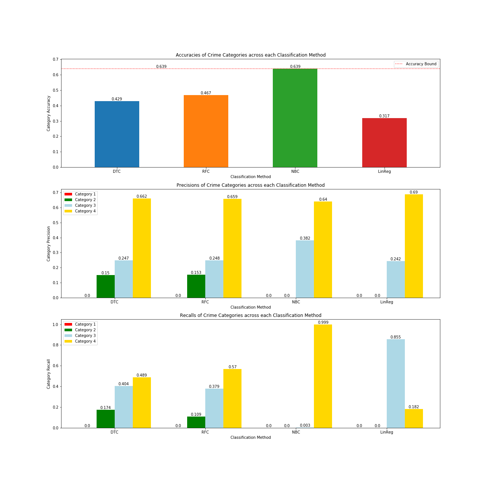  

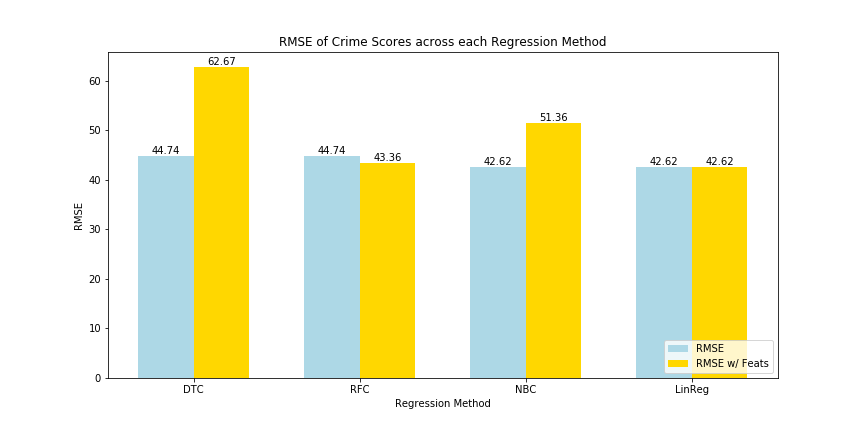  

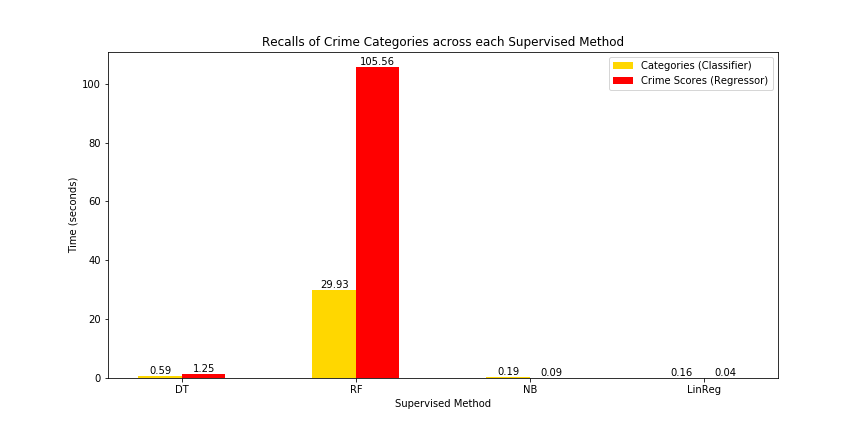

## Discussion 
True crime prediction entails a complex set of variables that may not be publicly available for intrepid data scientists. Socioeconomic factors may be difficult to aggregate, while psychological motivators are highly abstract. Identification of crime hotspots allows law enforcement agencies to allocate police routes and other crime inhibiting factors, such as CCTV cameras, lights or neighborhood watches, more effectively [3]. Crime inciters, such as gang territories, bars, and construction sites can be monitored more frequently. 

We evaluated our approach using accuracy, precision, and recall for classification of categories. In regression of crime scores, our metric is RMSE.

## Conclusion

#### Major Achievement
Our major achievement was our supervised model using crime score. Naive Bayes Classifier was our metric of choice. NBC was the 2nd quickest to run, it was also the 2nd best accuracy as well. Logistic Regression classification gave us our best accuracy of 0.637. The predicted values would be 1, 2, 3, or 4 based on the day and neighborhood. Classification methods and metrics that are above the lower bound that we set for. 
#### Future work
Without question, our methodology could be improved. Given more time and resources, we would plan to merge our dataset with other datasets regarding Atlanta's location specifics. Giving neighborhoods more features and more variability would only help our model learn and raise our accuracy. Another thing we may consider would be implementing similar prediction using deep learning neural networks.

The approach of splitting areas into grids and calculating within those regions (while fine-tuning the grid-size) could be integrated into our approach, whether "globally" -within the whole city- or "locally" -within each neighborhood- for greater effect. Addition of Twitter datafeed into the Machine Learning model has been proven to increase accuracy for the grid-based approach, and would be interesting to see the effects of on the afore-mentioned hybrid.

Although we had access to 300,000+ rows of data, access to more data/features would make our model more robust.

## References 
[1] Schiller, Andrew. "Atlanta, GA Crime Rates & Statistics." NeighborhoodScout. NeighborhoodScout, 10 June 2019. Web. 30
Sept. 2019.  

[2] Mcclendon, Lawrence, and Natarajan Meghanathan. "Using Machine Learning Algorithms to Analyze Crime
Data." Machine Learning and Applications: An International Journal 2.1 (2015): 1-12. Print.  

[3] Lin, Ying-Lung, Meng-Feng Yen, and Liang-Chih Yu. "Grid-Based Crime Prediction Using Geographical Features."
ISPRS International Journal of Geo-Information 7.8 (2018): 298. Print.  

[4] Kim, Suhong, Param Joshi, Parminder Singh Kalsi, and Pooya Taheri. "Crime Analysis Through Machine Learning."
2018 IEEE 9th Annual Information Technology, Electronics and Mobile Communication Conference (IEMCON)
(2018): n. pag. Print.  

[5] Bappee, Fateha Khanam, Amílcar Soares Júnior, and Stan Matwin. "Predicting Crime Using Spatial Features."
Advances in Artificial Intelligence Lecture Notes in Computer Science (2018): 367-73. Print.  

Tech Stack Utilized: SciKit Learn, Seaborn, Matplotlib, Pandas, Numpy, Python, Jupyter,


### Contributions from each team member:
1. Gabriel Leventhal-Douglas: Unsupervised learning and GitHub pages
2. Abdurrahmane Rikli: Unsupervised learning and visualizations
3. Sanjeev Prasada: Preprocessing and GitHub pages
4. Aayush Dubey: Supervised learning and hypertuning parameters for model
5. Kevin Tynes: Unsupervised learning and preprocessing

Although members led different portions of our project, we all believe that our individual contributions were equivalent.
